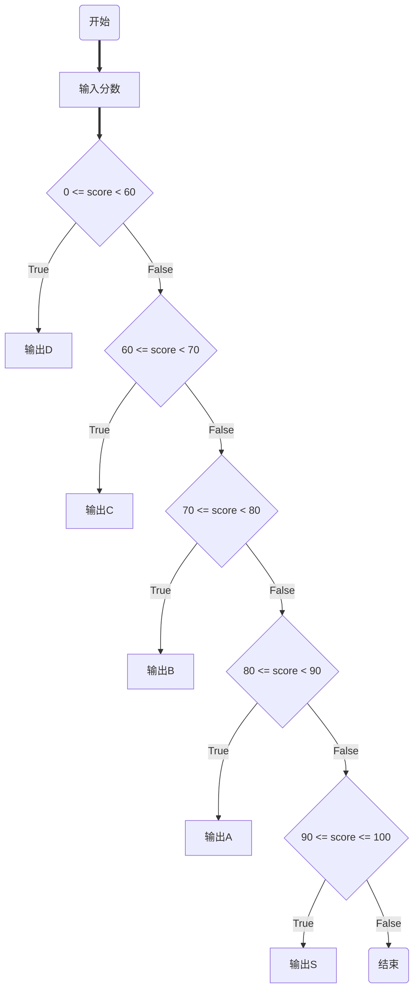

[TOC]


#### 一、分支语句

1. 判断单个条件

   ```python
   if condition1:
       statement(s)
   ```

2. 判断多个条件

   ```python
   if condition1:
       statement(s)
   elif condition2:
       statement(s)
   elif condition3:
       statement(s)
   ...
   ```

   ---

   学生的分数处于[0,60)，成绩为D，学生的分数处于[60,70)，成绩为C，学生的分数处于[70,80)，成绩为B，学生的分数处于[80,90)，成绩为A，学生的分数处于[90,100]，成绩为S。

   ```py
   score = input("请输入学生的分数:")
   score = int(score)
   
   if 0 <= score <60:
       print("D")
   elif 60 <= score < 70:
       print("C")
   elif 70 <= score < 80:
       print("B")
   elif 80 <= score < 90:
       print("A")
   elif 90 <= score <= 100:
       print("S")



3. 条件表达式

   条件表达式相当于一个完整的`if-else`语句

   ```python
   条件成立时执行的语句 if condition1 else 条件不成立时执行的语句
   ```

   ---

   同上例

   ```python
   score = 66
   level = ("D" if 0 <= score < 60 else
            "C" if 60 <= score < 70 else
            "B" if 70 <= score < 80 else
            "A" if 80 <= score < 90 else
            "S" if 90 <= score <= 100 else
            "请输入0~100之间的分数。")
   #输出C
   ```

   

#### 二、循环语句

1.`while`

```python
while condition:
    statement(s)
```

---

求1+2+3+...+100.

```python
i = 1
sum = 0
while i <= 100:
    sum += i
    i += 1
```

输出(0,10)以内的偶数

```python
i = 0
while i < 10:  
    if i % 2 == 0:
        print(i)
    i += 1
```

打印九九乘法表

```python
i = 1
while i < 10:
    j = 1
    while j <= i:
        print(f"{j}*{i}={j*i:2}", end=' ')
        j += 1
    print()
    i += 1
```


`while-else`独特之处在于，`else`的子句仅在`while`条件不满足时执行。它可以用来检测循环的退出情况，有时因`break`退出时，循环条件成立，将不执行`else`的子句。

2.`for-in`

```python
for 变量 in 可迭代对象:
    statement(s)
```

---

打印字符串的每个元素

```python
for each in 'It rains cats and dogs.':
    print(each)
```

```python
i = 0
s = 'It rains cats and dogs.'
while i < len(s):
    print(s[i])
    i += 1
```

输出0~99

```python
for i in range(0,100):
    print(i)
```

`for-else`同理

判断[2,9]内的素数

```python
for n in range(2,10):
    for x in range(2,n):
        if n % x == 0:
            print(n,"=",x,"*",n//x)
            break
    else:
        print(n,"是一个素数")
```

#### 三、`break`和`continue`语句

`break`中断一层循环，`continue`跳到下一次循环

```python
# 示例：查找列表中第一个大于 50 的数
nums = [12, 45, 67, 89, 34]
for num in nums:
    if num > 50:
        print(f"找到第一个大于50的数：{num}")
        break
else:
    print("列表中无大于50的数")
```

